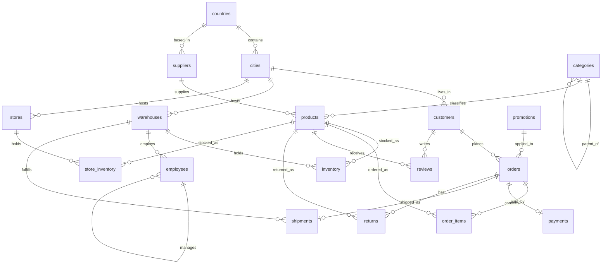

# SQL Practice Lab

A PostgreSQL-based SQL curriculum designed as a durable, metadata-driven learning lab. The first module ships with five `SELECT` exercises; future modules are added through the catalog instead of by hand-maintaining hundreds of files.

## Quick start

1. Install PostgreSQL 16+ and Python 3.12+.
2. Create and activate a virtual environment, then install dependencies: `python -m pip install -r requirements.txt`.
3. Run the complete setup with your PostgreSQL `postgres` role: `python setup_database.py --recreate --scale dev --password YOUR_PASSWORD`.
4. Render exercises: `python scripts/build_problems.py`.
5. The renderer creates a blank answer file beside every problem. Write your query in `exercises/01-select/q001.sql`, then grade it as described in [Grade answers](#grade-answers).

Set `SQL_PRACTICE_DSN` if your PostgreSQL connection differs from the default `postgresql://postgres@localhost:5432/sql_practice`. `setup_database.py` and the grader accept `--password`; alternatively set `PGPASSWORD` before running them so the password does not appear in shell history.

## Database setup modes

`python setup_database.py --recreate --scale dev --password YOUR_PASSWORD` terminates active connections, drops `sql_practice`, creates it again, loads `schema.sql`, generates `data.sql`, and loads that file. Use it when you want a clean start.

`python setup_database.py --append --scale dev --password YOUR_PASSWORD` preserves an existing initialized database and all of its rows. If the database does not exist, has no schema, or has a schema with no seed data, it initializes it. It does not re-import the deterministic seed into a populated database because that would create duplicate business records.

To use another database name, add `--database my_lab`. You can still run individual manual steps when useful:

```powershell
python generate_data.py --scale dev
psql -U postgres -d sql_practice -f data.sql
```

## Database schema

The lab uses PostgreSQL 16+ and models a multi-warehouse retailer. It includes
18 tables covering geography, customers, products, stock, staff, sales, and
post-sale activity. Primary keys are identity-backed `BIGINT` columns unless
noted otherwise; the complete executable definition is in
[schema.sql](schema.sql).



### Tables

| Table | Description | Key relationships |
| --- | --- | --- |
| `countries` | Country reference data identified by a unique two-letter code. | Referenced by `cities` and `suppliers`. |
| `cities` | Cities, unique within each country. | Belongs to `countries`; referenced by `customers`, `warehouses`, and `stores`. |
| `customers` | Customer profile, account status, email, and creation timestamp. | Optionally belongs to `cities`; places `orders` and writes `reviews`. |
| `suppliers` | Product suppliers and their contact details. | Optionally belongs to `countries`; supplies `products`. |
| `categories` | Product categories, including a self-referencing parent category for hierarchy exercises. | May have a parent `categories` row; classifies `products`. |
| `products` | Saleable products with SKU, price, active flag, supplier, and category. | Belongs to `suppliers` and `categories`; used in stock, order, review, and return tables. |
| `warehouses` | Warehouse locations, codes, names, and unit capacity. | Belongs to `cities`; holds `inventory`, employs `employees`, and fulfills `shipments`. |
| `inventory` | Warehouse-level stock and reorder thresholds. | Composite primary key: (`warehouse_id`, `product_id`); joins `warehouses` to `products`. |
| `employees` | Warehouse employees, roles, hire dates, and reporting hierarchy. | Optionally belongs to `warehouses`; `manager_id` self-references `employees`. |
| `promotions` | Discount codes with percentages and active date ranges. | May be applied to `orders`. |
| `orders` | Customer orders with status, order time, optional promotion, and shipping fee. | Belongs to `customers`; may use `promotions`; has items, a payment, and a shipment. |
| `order_items` | Products and quantities purchased in an order, preserving the unit price at purchase time. | Composite primary key: (`order_id`, `product_id`); joins `orders` to `products`. |
| `payments` | One payment record per order, with method, amount, time, and status. | One-to-one with `orders` through unique `order_id`. |
| `shipments` | One fulfillment shipment per order, including warehouse, tracking, dates, and status. | One-to-one with `orders`; fulfilled from `warehouses`. |
| `reviews` | Product ratings and optional review text from customers. | Belongs to `products` and `customers`; one review per customer/product pair. |
| `returns` | Requested returns of individual products from orders. | Belongs to `orders` and `products`; one return per order/product pair. |
| `stores` | Retail-store locations with codes, names, and opening dates. | Belongs to `cities`; holds `store_inventory`. |
| `store_inventory` | Store-level product stock. | Composite primary key: (`store_id`, `product_id`); joins `stores` to `products`. |

Important constraints support realistic practice queries: emails, codes, SKUs,
and tracking numbers are unique; quantities and prices cannot be negative; and
status fields are limited to their documented lifecycle values. `order_items`
are deleted automatically if their parent order is deleted. The schema also
includes indexes for common order, product, review, and low-stock lookups.

## Grade answers

The grader executes your answer and the official solution in separate
read-only transactions, then compares columns, rows, duplicates, ordering,
`NULL`s, and numeric values.

Grade one exercise:

```powershell
python grader.py --problem Q001 --password YOUR_PASSWORD
```

Grade every exercise in a topic:

```powershell
python grader.py --topic "OUTER JOIN" --password YOUR_PASSWORD
```

Use `--problem` with an exercise ID such as `Q050`, or use `--topic` with the
topic name shown in the exercise heading. Both filters may be combined. The
command exits with status `0` only when every selected answer passes, making it
suitable for automated checks. Set `PGPASSWORD` to omit `--password`, and set
`SQL_PRACTICE_DSN` when grading a database other than the default local lab.

## Authoring exercises

Add structured metadata to `exercise_catalog.json`, create the matching instructor solution in `solutions/`, and run `python scripts/build_problems.py`. The renderer creates the Markdown problem statement, a blank answer file beside it in `exercises/<topic>/`, and the registry automatically. Keep `solutions/` in a private instructor repository or release artifact if students must not see answers; GitHub cannot hide files committed to a public repository.

For curriculum consistency, exercises rated 4/5 or 5/5 should use the current topic together with any concepts covered in earlier modules when that strengthens the exercise. Keep lower-rated exercises focused more tightly on the current topic.

Existing answer files are never overwritten.

## Dataset scales

`dev` is fast for local iteration. `full` targets approximately 5,000 customers, 2,000 products, 50,000 orders, and 250,000 order items. Both use the same fixed seed.

## Verify data coverage

The seed data is designed so every released official solution returns rows, and
edge-case exercises have meaningful contrasts (for example, both zero and
positive counts in outer-join exercises). After creating or recreating the
database, run:

```powershell
python scripts/verify_data_coverage.py --password YOUR_PASSWORD *> coverage-report.txt
```

The command writes a per-exercise report to `coverage-report.txt` and exits
with a non-zero status if a solution is empty or an outer-join contrast is
missing. Use `--recreate` when changing seed-generation logic; `--append`
preserves the existing data and therefore does not apply new seed scenarios.

See [the architecture notes](docs/architecture.md) for component responsibilities.
The full sequence and release status are in the [curriculum roadmap](docs/curriculum.md).
The deterministic seed's exercise-coverage contract is documented in
[the data coverage notes](docs/data-coverage.md).
